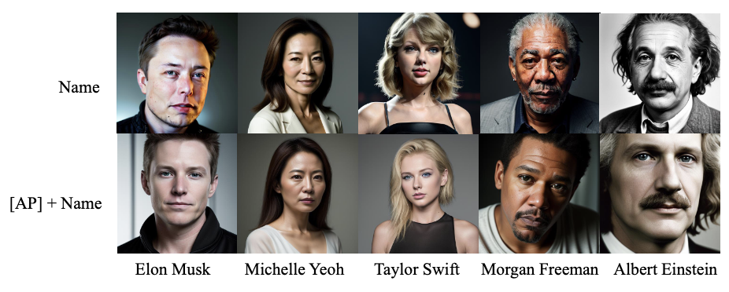
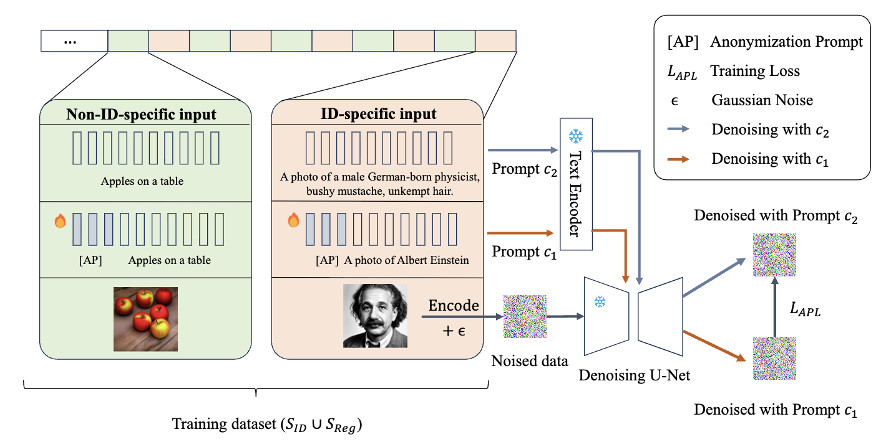

# Anonymization Prompt Learning (APL) 




## News

🎉 **Our paper "Anonymization Prompt Learning for Facial Privacy-Preserving Text-to-Image Generation"[[arXiv](https://arxiv.org/abs/2405.16895)] has been accepted to International Journal of Computer Vision (IJCV) in February 2026.**


## Abstract

Text-to-image diffusion models, such as Stable Diffusion, generate highly realistic images from text descriptions. However, the generation of certain content at such high quality raises concerns. A prominent issue is the accurate depiction of identifiable facial images, which could lead to malicious deepfake generation and privacy violations. In this paper, we propose Anonymization Prompt Learning (APL) to address this problem. Specifically, we train a learnable prompt prefix for text-to-image diffusion models, which forces the model to generate anonymized facial identities, even when prompted to produce images of specific individuals. Extensive quantitative and qualitative experiments demonstrate the successful anonymization performance of APL, which anonymizes any specific individuals without compromising the quality of non-identity-specific image generation. Furthermore, we reveal the plug-and-play property of the learned prompt prefix, enabling its effective application across different pretrained text-to-image models for transferrable privacy and security protection against the risks of deepfakes.



## Key Components

### EmbeddingManager

The `EmbeddingManager` class (in `ldm/modules/embedding_manager.py`) manages learnable prompt embeddings. It:
- Initializes placeholder token embeddings (default: 'alz')
- Supports multi-vector tokens (default: 10 vectors per token)
- Handles embedding save/load operations
- Integrates with CLIP text encoders

### Training Process

The training alternates between:
1. **Identity anonymization**: Transforming specific person prompts to anonymized face attribute descriptions
2. **General image preservation**: Maintaining quality for non-identity-specific prompts

The loss function encourages the learned prefix to push identity-specific prompts toward anonymized representations while preserving general image quality.


## Installation

### Setup

1. Clone this repository:
```bash
git clone https://github.com/shiliang26/APL
cd APL-main
```

2. Install required Python packages:
```bash
pip install -r requirements.txt
```

3. Download the Stable Diffusion v1.5 checkpoint:
   - Place the checkpoint file at `./models/Stable-diffusion/v1-5-pruned-emaonly.ckpt`
   - Or update the `--ckpt_path` argument in training scripts

4. Prepare datasets:
   - For training, you'll need:
     - Face identity dataset (organized in `./data/face/`)
     - Generic text-image pair dataset: You can use LAION dataset images (in `./data/laion/` directory) or your own generic text-image pair dataset. The dataset should contain image files and corresponding text prompts.
     - Prompt templates file (`./templates.txt`)
     - General prompts file (`./prompts.txt`)

## Usage

### Training

Train an anonymization prompt prefix using the main training script:

```bash
python train.py \
    --prompt <prompt_name> \
    --train_method <method> \
    --iterations <num_iterations> \
    --lr <learning_rate> \
    --config_path configs/stable-diffusion/v1-inference.yaml \
    --ckpt_path ./models/Stable-diffusion/v1-5-pruned-emaonly.ckpt \
    --devices 0,1 \
    --ddim_steps 50
```

**Key Arguments:**
- `--prompt`: Name/identifier for the prompt being trained
- `--train_method`: Training method identifier
- `--iterations`: Number of training iterations (default: 1000)
- `--lr`: Learning rate (default: 1e-5)
- `--devices`: CUDA device IDs (e.g., "0,1" for multi-GPU)
- `--ddim_steps`: Number of DDIM sampling steps for training (default: 50)

The trained embedding will be saved in `./embeddings/` directory.

### Inference

#### Test Identity Anonymization

Test the anonymization performance on face identities:

```bash
python test_id.py
```

This script evaluates the identity distance between generated images and ground truth face embeddings using InsightFace.

#### Test FID and CLIP Score

Evaluate generation quality using FID and CLIP scores:

```bash
python test_fid_clip_score.py
```

Configure the test by modifying the script variables:
- `embedding`: Path to the trained embedding file
- `benchmark`: Dataset to evaluate on (e.g., 'coco_person_prompts')
- `anonymize`: Boolean flag to enable/disable anonymization

#### Generate Anonymized Images

To generate anonymized images with a trained embedding:

1. Load the embedding in your script:
```python
from ldm.modules.embedding_manager import EmbeddingManager

embedding_manager = EmbeddingManager(...)
embedding_manager.load('./embeddings/APL-v1.1-9999.pt')
```

2. Use the placeholder token 'alz' in your prompts:
```python
prompt = "alz A close-up portrait of [person name]"
```

## Project Structure

```
APL-main/
├── train.py                 # Main training script
├── test_id.py              # Identity anonymization testing
├── test_fid_clip_score.py  # FID and CLIP score evaluation
├── dataset_generation.py   # Dataset generation utilities
├── args/
│   └── clip_args.py        # CLIP evaluation arguments
├── configs/
│   └── stable-diffusion/   # Stable Diffusion configuration files
├── ldm/                    # Latent Diffusion Model implementation
│   ├── models/            # Model definitions
│   ├── modules/           # Core modules
│   │   └── embedding_manager.py  # Embedding manager for prompt learning
│   └── data/              # Dataset loaders
└── README.md
```


## Cite Us

If you find our work helpful, please cite our paper:

```bibtex
@article{shi2024anonymization,
  title={Anonymization prompt learning for facial privacy-preserving text-to-image generation},
  author={Shi, Liang and Zhang, Jie and Shan, Shiguang},
  journal={arXiv preprint arXiv:2405.16895},
  year={2024}
}
```
